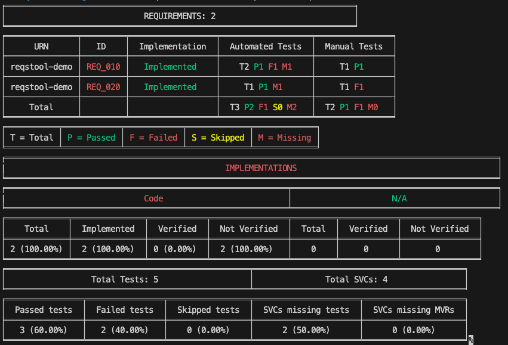

= Reqstool Demo
:toc:
:toc-placement!:

image:https://img.shields.io/github/commit-activity/m/Luftfartsverket/reqstool-demo?label=commits&style=for-the-badge["Commit Activity", link="https://github.com/Luftfartsverket/reqstool-demo/pulse"]
image:https://img.shields.io/github/issues/Luftfartsverket/reqstool-demo?style=for-the-badge&logo=github["GitHub Issues", link="https://github.com/Luftfartsverket/reqstool-demo/issues"]
image:https://img.shields.io/badge/Java-21-brightgreen.svg?style=for-the-badge["JVM support", link="https://sdkman.io"]
image:https://img.shields.io/github/license/Luftfartsverket/reqstool-demo?style=for-the-badge&logo=opensourceinitiative["License", link="https://opensource.org/license/mit/"]
image:https://img.shields.io/github/actions/workflow/status/Luftfartsverket/reqstool-demo/build.yml?style=for-the-badge&logo=github["Build", link="https://github.com/Luftfartsverket/reqstool-demo/actions/workflows/build.yml"]
image:https://img.shields.io/badge/Documentation-blue?style=for-the-badge&link=docs["Static Badge", link="https://luftfartsverket.github.io/reqstool-demo/reqstool-demo/0.0.1/index.html"]

Demo project showing how to use the link:https://github.com/Luftfartsverket/reqstool-java-maven-plugin[reqstool-maven-plugin] or link:https://github.com/Luftfartsverket/reqstool-gradle-plugin[reqstool-gradle-plugin] to create requirements traceability artifacts.

toc::[]

== Overview

This project demonstrates:

* Using `@Requirements` and `@SVCs` annotations in Java code
* Automatic generation of annotations from source code
* Assembly of a ZIP artifact containing requirements, test results, and traceability data
* Integration with the reqstool Python client for requirements analysis
* Support for both Maven and Gradle build systems

== Prerequisites

* Java 21+
* Maven 3.9+ or Gradle 9.3+
* Python 3.8+ (for reqstool client)
* libgit2 (for reqstool client):
** macOS: `brew install libgit2`
** Linux: `apt-get install libgit2-dev` or `yum install libgit2-devel`

== Quick Start

=== Build with Maven

[source,bash]
----
mvn clean verify
----

This will:

1. Compile source code and generate requirements annotations
2. Run tests and generate Software Verification Cases (SVCs) annotations
3. Combine annotations into a single file
4. Assemble a ZIP artifact `reqstool-demo-0.0.4-reqstool.zip` in `target/reqstool/` containing:
   * `requirements.yml` - Requirements definitions
   * `software_verification_cases.yml` - Test case definitions
   * `annotations.yml` - Combined traceability annotations
   * `test_results/` - JUnit XML test results
   * `reqstool_config.yml` - Configuration manifest

=== Build with Gradle

[source,bash]
----
gradle clean build
----

This will:

1. Compile source code and generate requirements annotations
2. Run tests and generate Software Verification Cases (SVCs) annotations
3. Combine annotations into a single file
4. Assemble a ZIP artifact `reqstool-demo-0.0.4-reqstool.zip` in `build/reqstool/` containing:
   * `requirements.yml` - Requirements definitions
   * `software_verification_cases.yml` - Test case definitions
   * `annotations.yml` - Combined traceability annotations
   * `test_results/` - JUnit XML test results
   * `reqstool_config.yml` - Configuration manifest

=== Install Reqstool Python Client

==== Linux

[source,bash]
----
# Install libgit2 dependency
# Ubuntu/Debian:
sudo apt-get install libgit2-dev

# RHEL/CentOS/Fedora:
sudo yum install libgit2-devel

# Create virtual environment (recommended)
python3 -m venv venv
source venv/bin/activate

# Install reqstool (libgit2 is typically in system paths)
pip install reqstool
----

==== macOS

[source,bash]
----
# Install libgit2 dependency
brew install libgit2

# Create virtual environment (recommended)
python3 -m venv venv
source venv/bin/activate

# Install reqstool with compiler flags (required to find libgit2 headers)
CFLAGS="-I/opt/homebrew/include" LDFLAGS="-L/opt/homebrew/lib" pip install reqstool
----

NOTE: The `CFLAGS` and `LDFLAGS` are required because Homebrew installs libraries in `/opt/homebrew` (Apple Silicon) or `/usr/local` (Intel), and the Python package build process needs explicit paths to find the libgit2 headers and libraries for compiling the `pygit2` native extension.

=== Analyze Requirements

You can analyze requirements directly from the project directory or from the extracted ZIP artifact.

==== Analyze from Project Directory

[source,bash]
----
# Run reqstool status report
reqstool status local -p ./docs/reqstool

# Generate detailed reports
reqstool report status -p ./docs/reqstool
----

==== Analyze from ZIP Artifact

[source,bash]
----
# For Maven build:
cd target/reqstool
unzip reqstool-demo-*-reqstool.zip
cd reqstool-demo-*-reqstool

# For Gradle build:
cd build/reqstool
unzip reqstool-demo-0.0.4-reqstool.zip
cd reqstool-demo-0.0.4-reqstool

# Run analysis from extracted artifact
reqstool status local -p .
----

The `reqstool status local` command generates a comprehensive report showing:

* Requirements implementation status
* Automated test coverage and results (passed/failed/skipped)
* Manual verification results
* Software Verification Cases (SVCs) status
* Missing tests and manual verification results

TIP: For color-coded output in your terminal, ensure your terminal supports ANSI colors.

== Project Structure

=== Maven Build

----
reqstool-demo/
├── pom.xml                           # Maven configuration with reqstool plugin
├── docs/reqstool/                    # Requirements data directory
│   ├── requirements.yml              # Requirements definitions (mandatory)
│   ├── software_verification_cases.yml  # Test case definitions (optional)
│   └── manual_verification_results.yml  # Manual test results (optional)
├── src/
│   ├── main/java/                    # Implementation code with @Requirements
│   └── test/java/                    # Test code with @SVCs
└── target/
    ├── generated-sources/            # Generated requirements annotations
    ├── generated-test-sources/       # Generated SVCS annotations
    └── reqstool/                     # Output directory with ZIP artifact
----

=== Gradle Build

----
reqstool-demo/
├── build.gradle                      # Gradle configuration with reqstool plugin
├── docs/reqstool/                    # Requirements data directory
│   ├── requirements.yml              # Requirements definitions (mandatory)
│   ├── software_verification_cases.yml  # Test case definitions (optional)
│   └── manual_verification_results.yml  # Manual test results (optional)
├── src/
│   ├── main/java/                    # Implementation code with @Requirements
│   └── test/java/                    # Test code with @SVCs
└── build/
    ├── generated/sources/annotationProcessor/  # Generated annotations
    └── reqstool/                     # Output directory with ZIP artifact
----

== Annotations

=== @Requirements Annotation

Used in implementation code to link code to requirements:

[source,java]
----
import se.lfv.reqstool.annotations.Requirements;

@Requirements({"REQ-001", "REQ-002"})
public class MyClass {
    // Implementation
}
----

=== @SVCs Annotation

gottUsed in test code to link tests to Software Verification Cases:

[source,java]
----
import se.lfv.reqstool.annotations.SVCs;

@Test
@SVCs("SVC_010")
public void testMethod1() {
    // Test implementation
}
----

== Configuration

=== Maven Plugin

The reqstool-maven-plugin is configured in `pom.xml`:

[source,xml]
----
<plugin>
    <groupId>se.lfv.reqstool</groupId>
    <artifactId>reqstool-maven-plugin</artifactId>
    <version>1.0.3</version>
    <executions>
        <execution>
            <goals>
                <goal>assemble-and-attach-zip-artifact</goal>
            </goals>
        </execution>
    </executions>
    <configuration>
        <datasetPath>${project.basedir}/docs/reqstool</datasetPath>
    </configuration>
</plugin>
----

Default configuration values:

* **requirementsAnnotationsFile**: `target/generated-sources/annotations/resources/annotations.yml`
* **svcsAnnotationsFile**: `target/generated-test-sources/test-annotations/resources/annotations.yml`
* **outputDirectory**: `target/reqstool`
* **datasetPath**: `reqstool/`
* **testResults**: `target/surefire-reports/**/*.xml`, `target/failsafe-reports/**/*.xml`

=== Gradle Plugin

The reqstool-gradle-plugin is configured in `build.gradle`:

[source,gradle]
----
buildscript {
    repositories {
        mavenLocal()  // For local development
        mavenCentral()
    }
    dependencies {
        classpath 'se.lfv.reqstool:reqstool-gradle-plugin:0.1.0'
    }
}

apply plugin: 'se.lfv.reqstool'

requirementsTool {
    datasetPath = file('docs/reqstool')
}

// Wire the task into the build lifecycle
tasks.named('build') {
    finalizedBy tasks.named('assembleRequirements')
}

tasks.named('assembleRequirements') {
    dependsOn tasks.named('test')
}
----

Default configuration values:

* **requirementsAnnotationsFile**: `build/generated/sources/annotationProcessor/java/main/resources/annotations.yml`
* **svcsAnnotationsFile**: `build/generated/sources/annotationProcessor/java/test/resources/annotations.yml`
* **outputDirectory**: `build/reqstool/`
* **datasetPath**: `reqstool/`
* **testResults**: `build/test-results/**/*.xml`

== Generated Artifacts

The plugin generates:

1. **Combined annotations** (`target/reqstool/annotations.yml`):
+
[source,yaml]
----
requirement_annotations:
  implementations:
    com.reqstool.example.demo.DemoApplication:
      - REQ-001
  tests:
    com.reqstool.example.demo.SVCsTest.testMethod1:
      - SVC_010
----

2. **ZIP artifact** (`target/reqstool/reqstool-demo-*-reqstool.zip` for Maven or `build/reqstool/reqstool-demo-reqstool.zip` for Gradle):
   - Contains all requirements data, annotations, and test results
   - Created with classifier `reqstool` and extension `zip`
   - Published to Maven repositories alongside other project artifacts (JAR, sources, javadoc)
   - Can be processed by reqstool Python client

== Publishing

When you publish your project to a Maven repository (using `mvn deploy` or Gradle's `publish` task), the reqstool ZIP artifact is automatically attached and published alongside your main artifacts:

* `reqstool-demo-0.0.4.jar` - Main application JAR
* `reqstool-demo-0.0.4-sources.jar` - Source code (if configured)
* `reqstool-demo-0.0.4-javadoc.jar` - JavaDoc documentation (if configured)
* `reqstool-demo-0.0.4-reqstool.zip` - Requirements traceability artifact

The ZIP artifact uses the `reqstool` classifier, making it easy to identify and retrieve from Maven repositories. This allows teams to:

* Track requirements traceability across releases
* Automate compliance reporting in CI/CD pipelines
* Share requirements data with stakeholders
* Integrate with requirements management tools

[source,bash]
----
# Deploy to Maven repository
mvn deploy

# Or with Gradle
gradle publish
----

== License

MIT License - see link:LICENSE[LICENSE] file for details

== Links

* link:https://github.com/Luftfartsverket/reqstool-java-maven-plugin[reqstool-maven-plugin]
* link:https://github.com/Luftfartsverket/reqstool-gradle-plugin[reqstool-gradle-plugin]
* link:https://github.com/Luftfartsverket/reqstool-client[reqstool Python client]
* link:https://luftfartsverket.github.io/reqstool-demo/reqstool-demo/0.0.1/index.html[Documentation]
